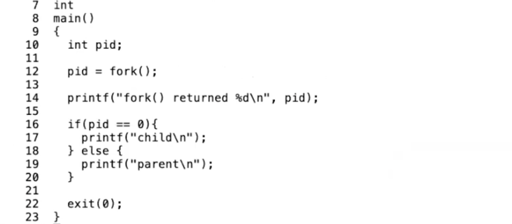
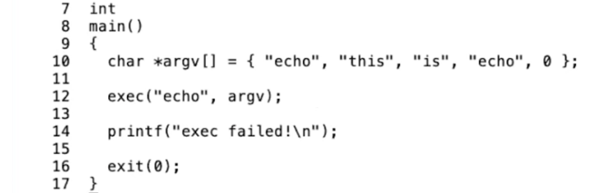
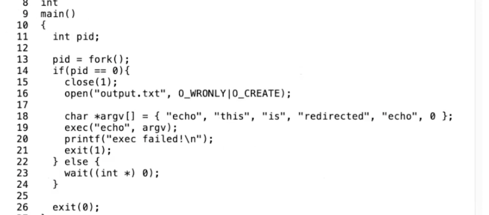
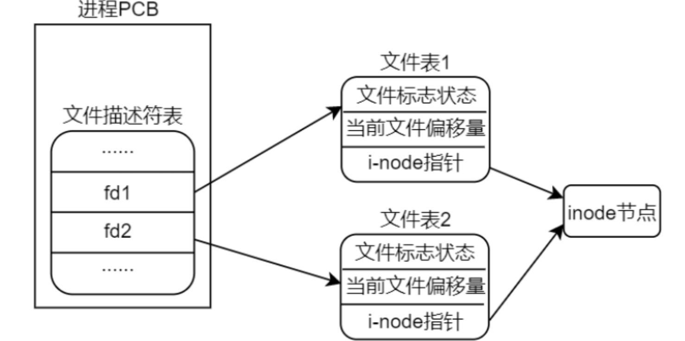
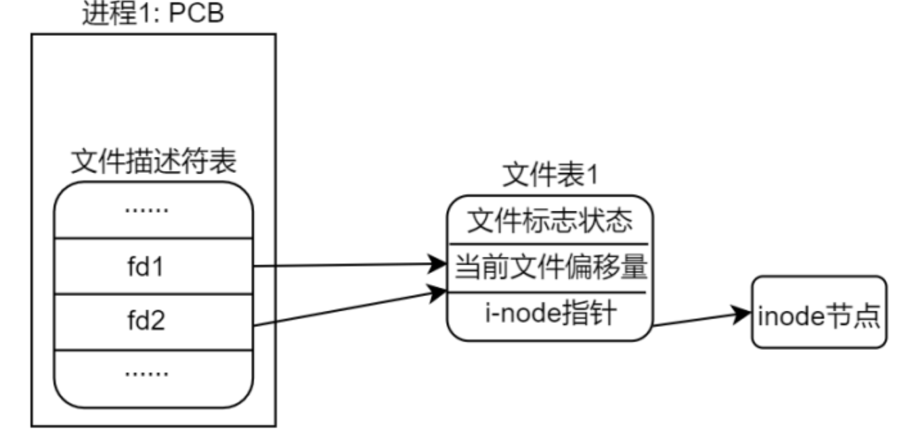
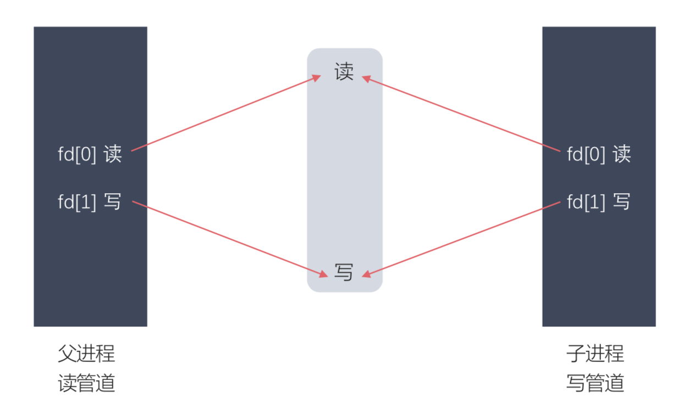

[TOC]

#### 简介

Operating system interfaces


##### 文件描述符

> A *file descriptor* is a small integer representing a kernel-managed object that a process may read from or write to. A process may obtain a file descriptor by opening a file, directory, or device, or by creating a pipe, or by duplicating an existing descriptor. For simplicity we’ll often refer to the object a file descriptor refers to as a “file”; the file descriptor interface abstracts away the differences between files, pipes, and devices, making them all look like streams of bytes. We’ll refer to input and output as *I/O*.

文件描述符是一个整数，表示一个进程可以进行读写的内核管理对象。文件描述符是对文件，管道，设备等的高度抽象，消除了它们之间的差异，使得它们使用起来像字节流，可以对其进行输入输出操作。


##### fork



fork会拷贝当前进程的内存，并创建一个新的进程，这里的内存包含了进程的指令和数据。之后，我们就有了两个拥有完全一样内存的进程。fork系统调用在两个进程中都会返回，在原始的进程中，fork系统调用会返回大于0的整数，这个是新创建进程的ID。而在新创建的进程中，fork系统调用会返回0。

在XV6中，除了fork的返回值，两个进程是一样的。两个进程的指令是一样的，数据是一样的，栈是一样的，同时，两个进程又有各自独立的地址空间，它们都认为自己的内存从0开始增长，但这里是不同的内存。

除了内存是一样的以外，文件描述符的表单也从父进程拷贝到子进程。所以如果父进程打开了一个文件，子进程可以看到同一个文件描述符，尽管子进程看到的是一个文件描述符的表单的拷贝。除了拷贝内存以外，fork还会拷贝文件描述符表单这一点还挺重要的


##### exec和wait



代码会执行exec系统调用，这个系统调用会从指定的文件中读取并加载指令，并替代当前调用进程的指令。从某种程度上来说，这样相当于丢弃了调用进程的内存，并开始执行新加载的指令。

>  exec系统调用会保留当前的文件描述符表单。所以任何在exec系统调用之前的文件描述符，例如0，1，2等。它们在新的程序中表示相同的东西。
>
> 通常来说exec系统调用不会返回，因为exec会完全替换当前进程的内存，相当于当前进程不复存在了，所以exec系统调用已经没有地方能返回了

exec函数只有调用的程序不存在，即exec调用失败才会执行后面的语句。


wait系统调用，使得父进程可以等待任何一个子进程返回。传入参数&status，将status对应的地址传递给内核，内核会向这个地址写入子进程向exit传入的参数。wait返回值时子进程的pid。

如果有多个子进程，wait需要调用多次。如果调用wait的进程没有子进程，那么wait会立即返回-1。


###### 为什么fork和exec放在一起使用，而不单独使用exec

对于那些想要运行程序，但是还希望能拿回控制权的场景，可以先执行fork系统调用，然后在子进程中调用exec。

shell执行指令时，比如echo ls等命令时，其实本质上就是Shell会执行fork，之后fork出的子进程再调用exec系统调用，这是一个非常常见的Unix程序调用风格。


###### 为什么fork和exec要设计成两个函数

在xv6 book中解释到，在chapter1中的I/O and File descriptors section

> Now it should be clear why it is helpful that fork and exec are separate calls: between the two, the shell has a chance to redirect the child’s I/O without disturbing the I/O setup of the main shell. One could instead imagine a hypothetical combined forkexec system call, but the options for doing I/O redirection with such a call seem awkward. The shell could modify its own I/O setup before calling forkexec (and then un-do those modifications); or forkexec could take instructions for I/O redirection as arguments; or (least attractively) every program like cat could be taught to do its own I/O redirection.

设计成两个函数可以很方便的实现I/O重定向。子进程拷贝父进程的文件描述符表，在子进程中修改不会影响主线程


###### fork拷贝整个父进程，然后执行exec将整个拷贝丢弃，怎么处理

> 先调用fork，再在子进程中调用exec。这里实际上有些浪费，fork首先拷贝了整个父进程的，但是之后exec整个将这个拷贝丢弃了，并用你要运行的文件替换了内存的内容。某种程度上来说这里的拷贝操作浪费了，因为所有拷贝的内存都被丢弃并被exec替换。在大型程序中这里的影响会比较明显。如果你运行了一个几G的程序，并且调用fork，那么实际就会拷贝所有的内存，可能会要消耗将近1秒钟来完成拷贝，这可能会是个问题
>
> 在这门课程的后面，你们会实现一些优化，比如说copy-on-write fork，这种方式会消除fork的几乎所有的明显的低效，而只拷贝执行exec所需要的内存，这里需要很多涉及到虚拟内存系统的技巧。你可以构建一个fork，对于内存实行lazy拷贝，通常来说fork之后立刻是exec，这样你就不用实际的拷贝，因为子进程实际上并没有使用大部分的内存。我认为你们会觉得这将是一个有趣的实验


##### I/O Redirect



这是一个简单的I/O重定向示例，关闭了文件描述符1，此时在用open得到的文件描述符一定是1，因为文件描述符是递增的来分配，此时执行echo程序，本来应该输出到屏幕，echo仍然输出到文件描述符1中，结果就输入到了output.txt中。

shell中的重定向也是同样的道理：

```shell
echo hello > out
```

将hello输出到out文件中，Shell之所以有这样的能力，是因为Shell首先会像第13行一样fork，然后在子进程中，Shell改变了文件描述符。

> 同时，父进程的文件描述符1并没有改变。所以这里先fork，再更改子进程的文件描述符，是Unix中的常见的用来重定向指令的输入输出的方法，这种方法同时又不会影响父进程的输入输出。因为我们不会想要重定向Shell的输出，我们只想重定向子进程的输出


###### 重定向标准错误输出

格式： &> word >& word

说明:将标准输出与标准错误输出都定向到word代表的文件（以写的方式打开），两种格式意义完全相同，这种格式完全等价于 > word 2>&1 (2>&1 是将标准错误输出复制到标准输出，&是为了区分文件1和文件描述符1的

```shell
ls existing-file non-existing-file > tmp1 2>&1.
```

> Both the name of the existing file and the error message for the non-existing file will show up in the file tmp1.


##### dup和open

> The dup system call duplicates an existing file descriptor, returning a new one that refers to the same underlying I/O object. Both file descriptors share an offset, just as the file descriptors duplicated by fork do. 
>
> Two file descriptors share an offset if they were derived from the same original file descriptor by a sequence of fork and dup calls. Otherwise file descriptors do not share offsets, even if they resulted from open calls for the same file. 

dup函数会创建一个文件描述符的拷贝，两个文件描述符共享该文件描述符的偏移。

只有fork和dup能够做到，open不能做到。

可以理解为两个线程同时对一个文件执行写操作会冲突，因为它们不是共享文件描述符的偏移


使用open打开同一个文件




使用dup复制




测试用例：

```
int main()
{
    int dupfd = open("file_dup.txt", O_RDWR | O_CREAT);
    int dupfd2 = dup(dupfd);
    printf("%d %d\n", dupfd, dupfd2);
    
    if(fork() == 0) {
      int fd = open("./file.txt", O_RDWR | O_CREAT);
      int ret = lseek(fd, 0, SEEK_CUR);
      printf("child %d\n", ret);
      write(fd, "hello hello hello\n", 18);
      write(dupfd, "hello hello hello\n", 18);

      close(fd);  //测试close关闭是否影响后续
      exit(0);
    } else {
      int fd = open("./file.txt", O_RDWR | O_CREAT);
      int ret = lseek(fd, 0, SEEK_CUR);
      printf("parent %d\n", ret);
      wait(0);
      write(fd, "world\n", 6);
      write(dupfd2, "world\n ", 6);
    }

    close(dupfd);
}
```

上述用例将在file.txt中进行覆盖写，因为两个open打开文件，使用的是不同的偏移量，相当于两次写都从头开始，会进行覆盖。

但file_dup.txt则会进行追加，因为两个fd指向的是同一个文件偏移。

此处还验证了close只会关闭一个文件描述符，并不会把多个open打开的都关闭，这也是合理的。不然其他进程也在open这个文件，直接一个close全关了。

同样的，关闭dupfd和dupfd2其中一个，也不会导致文件都关闭。


##### pipe

> A *pipe* is a small kernel buffer exposed to processes as a pair of file descriptors, one for reading and one for writing. Writing data to one end of the pipe makes that data available for reading from the other end of the pipe. Pipes provide a way for processes to communicate.

pipe命令会返回一对文件描述符，一端用来读一端用来写，就像一个管道。

其中fd[0]用来读，fd[1]用来写。

> If no data is available, a read on a pipe waits for either data to be written or for all file descrip-tors referring to the write end to be closed;

如果访问管道的读端，比如用read方法，当没有数据时会阻塞，直到有数据写入，或者指向写端的文件描述符全部关闭。

当调用fork的时候，会出现类似如下的指向。



下面介绍一个xv6中一个比较经典的写法：

```shell
int main()
{
		int p[2];
    char *argv[2];
    argv[0] = "wc";
    argv[1] = 0;
    pipe(p);
    if(fork() == 0) {
      close(0);
      dup(p[0]);
      close(p[0]);
      close(p[1]);
      exec("/bin/wc", argv);
    } else {
      close(p[0]);
      write(p[1], "hello world\n", 12);
      close(p[1]);
		}
}
```

可以看到在子进程中，先关闭标准输入0，然后`dup(p[0])`，这样dup函数复制出来的文件描述符一定是0，且指向管道的读端。这样做是因为`/bin/wc`是接收标准输入0的数据的，那么现在就变成从管道的读端接收数据，并且此时会阻塞。父进程中会向管道中写入数据。


##### file system

一个简单的文件系统其实就是，把文件系统划分为目录dentry、文件、设备。

一个目录可以包括多个文件，文件底层是一个inode结点，inode包含了结点的元数据信息

> A file’s name is distinct from the file itself; the same underlying file, called an *inode*, can have multiple names, called *links*. Each link consists of an entry in a directory; the entry contains a file name and a reference to an inode. An inode holds *metadata* about a file, including its type (file or directory or device), its length, the location of the file’s content on disk, and the number of links to a file.
>
> The fstat system call retrieves information from the inode that a file descriptor refers to. It fills in a struct stat, defined in stat.h (kernel/stat.h) as:
>
> ```shell
>     #define T_DIR     1   // Directory
>     #define T_FILE    2   // File
>     #define T_DEVICE  3   // Device
>     struct stat {
>       int dev;     // File system’s disk device
>       uint ino;    // Inode number
>       short type;  // Type of file
>       short nlink; // Number of links to file
>       uint64 size; // Size of file in bytes
>      };
> ```


##### mknod

> ```shell
> mknod("/console", 1, 1);
> ```
>
> mknod creates a special file that refers to a device. Associated with a device file are the major and minor device numbers (the two arguments to mknod), which uniquely identify a kernel device. When a process later opens a device file, the kernel diverts read and write system calls to the kernel device implementation instead of passing them to the file system.


##### unlink

>```shell
>unlink(file_name)
>```
>
>The unlink system call removes a name from the file system. The file’s inode and the disk space holding its content are only freed when the file’s link count is zero and no file descriptors refer to it


##### XV6 and POSIX

POSIX全称是可移植操作系统接口(Portable Operating System Interface for UNIX)

> The Unix system call interface has been standardized through the Portable Operating System Interface (POSIX) standard. Xv6 is *not* POSIX compliant: it is missing many system calls (in- cluding basic ones such as lseek), and many of the system calls it does provide differ from the standard. Our main goals for xv6 are simplicity and clarity while providing a simple UNIX-like system-call interface. 

各种系统层出不穷，unix系统抽象出文件描述符这点非常重要

> Unix unified access to multiple types of resources (files, directories, and devices) with a single set of file-name and file-descriptor interfaces. This idea can be extended to more kinds of resources; a good example is Plan 9 [13], which applied the “resources are files” concept to networks, graph- ics, and more. However, most Unix-derived operating systems have not followed this route.